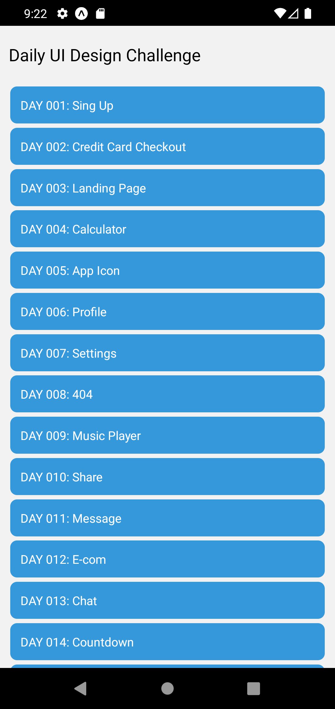

# Daily UI Challenge with React Native

Daily ui challenge of dailyui.co
All the screens are ui mocks, not a fully workable project but it gives you an idea about how to implement the ui with react native style.

## :blue_book: Installation
Clone the repo to your directory and install the packages through npm using:
```
npm install --force
```

## :microscope: Run
Run the project with Metro Bundler
```
npx expo start
```




**Disclamer:** The _content_ has been _made_ available informational and _educational purposes only_.